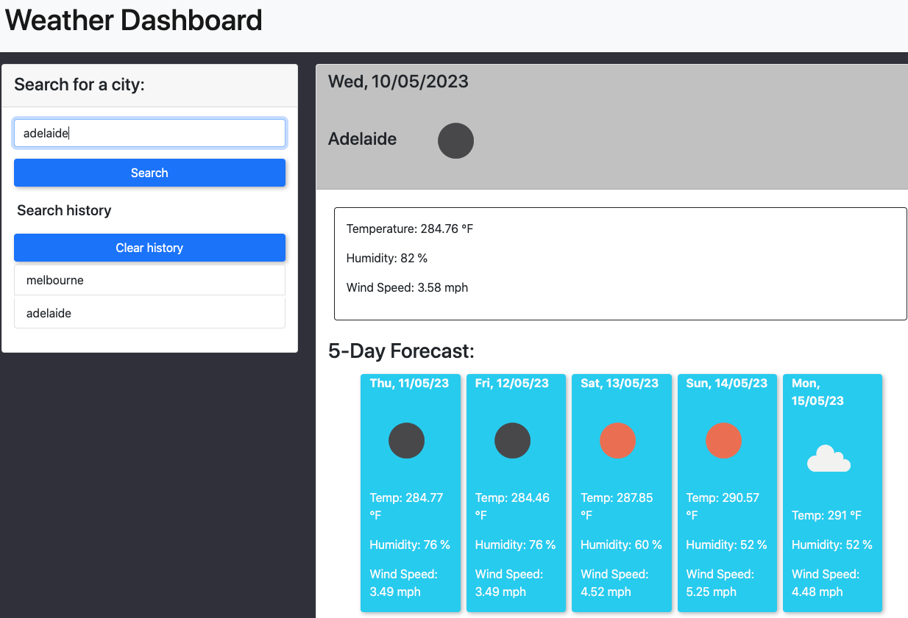
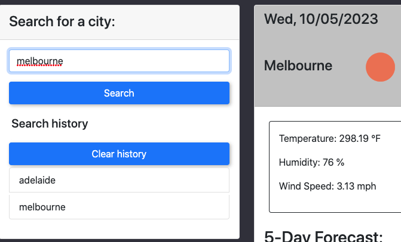

# Weather Dashboard App

## Description

This simple weather web app will allow you to search the weather, temperature, humidity and wind speed for the current date & forecast for upcoming five days.

The app was built using HTML, simple CSS (using a Bootstrap framework) and JavaScript. The primary aim for building this app was to demonstrate practical use of third-party API calls (e.g. for calling weather data).

[Deployment Link](https://gh120515.github.io/weather-dashboard-app/)

## Usage

### Basic usage

Enter a valid city name (e.g. Adelaide, Tokyo... etc) in the search field to call weather data for the current & upcoming five days. The weather will be displayed as an icon.

### Search history

Your past searches will be displayed below the search bar.

Click on each item (city name) to call the weather data again.

Click on 'Clear history' button to remove all history.

## Credits

CSS framework by [Bootstrap](https://getbootstrap.com/)

[Day.js](https://day.js.org/en/), a JavaScript Library for times and dates

Icons by [Font Awesome](https://fontawesome.com/)

[jQuery](https://jquery.com/), a JavaScript Library 

Weather data API by [OpenWeather](https://openweathermap.org/)

Tutorial by [Mark Lassoff](https://www.youtube.com/watch?v=buS3mweBWCA) 

## License

MIT Licensed